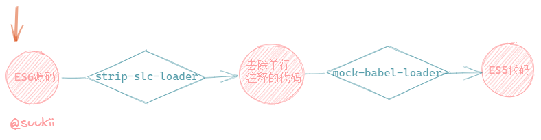

# 从零开始开发一个 webpack: Part 2

## 本节目标

实现 loader 支持。

## 概念介绍

根据 webpack 的官网解释，loader 就是一个导出了一个函数的 JS 模块，所以，本质上 loader 就是一个函数。loader 函数接收字符串或者 buffer 形式的文件内容作为参数，对这些内容进行某些操作处理后，返回处理后的字符串。

## 实现自己的 loader

既然知道了 loader 就是函数，那我们也可以来写自己的 loader 了，以下是两个简单的例子。

#### strip-slc-loader

`strip-slc-loader` 是一个负责删除单行注释的 loader。

- 输入：js 源码字符串
- 输出：删除所有单行注释后的 js 代码字符串

```js
module.exports = content => content.replace(/\/\/.*\n/g, '')
```

#### mock-babel-loader

`mock-babel-loader` 负责将 ES6 代码转化成 ES5 代码，在这里我们用到了 babel 核心库里面的一个同步 API `transformSync`，关于这个 API 的具体用法可以查阅[官网文档](https://babeljs.io/docs/en/babel-core#transformasync)。

- 输入：ES6 源码字符串
- 输出：ES5 代码字符串

```js
const babel = require('@babel/core')

module.exports = content => {
  return babel.transformSync(content, {
    presets: ['@babel/preset-env']
  }).code
}
```

## loader 特性

- loader 可以是同步或者异步的，上面两个例子都是同步的 loader (暂不考虑异步 loader)，在函数中直接 return 处理后的内容就可以了；
- loader 支持链式处理，也就是可以使用多个 loader 按顺序地处理一个文件，一个 loader 会接收上一个 loader 的处理结果作为参数，而且数据流的方向是根据配置的顺序从右往左的；
- loader 是在 Nodejs 中运行的；
- 等等。

loader 的特性有很多，但这里我们就只用到以上几个，更多的可以自行了解。

接下来我们可以着手实现在 mini-webpack 里面支持 loader 了。

## 使用效果

可以通过 `module.rules` 来配置不同类型文件需要使用哪些 loader 来处理。

```js
bundle({
  entry: '../example/entry.js',
  output: {
    path: 'dist',
    filename: 'bundle.js'
  },
  module: {
    rules: [{
      test: /\.js$/,
      use: [{
          loader: 'mock-babel-loader'
        },
        {
          loader: 'strip-slc-loader'
        }
      ]
    }]
  }
})
```

以上代码的意思是，遇到 js 文件的时候，先用 `strip-slc-loader` 把文件中的单行注释全部删掉，然后再用 `mock-babel-loader` 把 ES6 语法转化成 ES5 语法。



## 实现

接着来修改我们的 mini-webpack 源码来让它支持 loader。

#### bundle

首先，我们的 `bundle` 函数应该增加支持 `module` 选项，主要有下面几个改变。

```js
const bundle = options => {
  const {
    entry,
    output,
+    module,
  } = options

  // ...

  // 把 module.rules 传给 createModule
-  const entryModule = createModule(id++, path.resolve(__dirname, entry))
+  const entryModule = createModule(id++, path.resolve(__dirname, entry), module.rules)

  // 把 module.rules 传给 createModules 是为了进一步传给 createModule
-  const modules = [entryModule].concat(createModules(id, entryModule, module.rules))
+  const modules = [entryModule].concat(createModules(id, entryModule, module.rules))

  // ...
}
```

#### createModule

在 `createModule` 函数中，把文件内容传给 loader 进行处理。

```js
- const createModule = (id, path) => {
+ const createModule = (id, path, rules) => {
  let content = fs.readFileSync(path, {
    encoding: 'utf-8'
  })
  const dependencies = []

  // 增加 loader 机制后，createModule 理论上就支持了其他类型的文件
  // 所以这里需要判断，parser 只能处理 js 文件
+  if (/\.js$/.test(path)) {
    const ast = parser.parse(content, {
      sourceType: 'module'
    })

    traverse(ast, {
      ImportDeclaration({ node }) {
        dependencies.push(node.source.value)
      }
    })
+  }

  // 把文件内容交给 loader 处理
  // applyLoaders 会返回处理后的内容，以字符串的形式
+  content = applyLoaders(path, rules, content)

  return {
    id,
    content,
    dependencies,
    filename: path,
    mapping: {}
  }
}
```

#### applyLoaders

`applyLoaders` 是核心代码，负责：

1. 判断配置中是否有合适的 loader 来处理当前文件模块；
2. 按照配置顺序从右往左的顺序使用 loader 处理模块，并且当前 loader 接收的参数是上一个 loader 处理后的结果；
3. 返回处理后的文件内容；
4. 如果没有 loader 处理当前文件，给出提示。

```js
const applyLoaders = (modulePath, rules, content) => {
  // hit 用来标识该文件有没有合适的 loader 来处理
  // 没有的话给出提示
  let hit = false
  const res = rules.reduce((content, rule) => {
    if (rule.test.test(modulePath)) {
      hit = true
      // loader 的处理顺序是从右到左
      return rule.use.reduceRight((content, {loader}) => {
        // 引入 loader 函数并传入源码
        // 返回处理后的源码给下一个 loader
        // 我把自己写的 loader 模块都放在了 loaders 文件夹下面
        // 所以要去这个文件夹里找，找到后调用 loader 函数并传入文件内容
        return require(path.resolve('loaders', loader))(content)
      }, content)
    }
  }, content)

  hit || console.log(`${path}: You may need an appropriate loader to handle this file type.`);
  return res
}
```

## 小结

至此我们的 mini-webpack 就完成了 loader 的支持，在项目中运行 `npm run demo` 可以看到打包效果。

## Reference

[https://github.com/azl397985856/mono-webpack/tree/lecture/part-2](https://github.com/azl397985856/mono-webpack/tree/lecture/part-2)