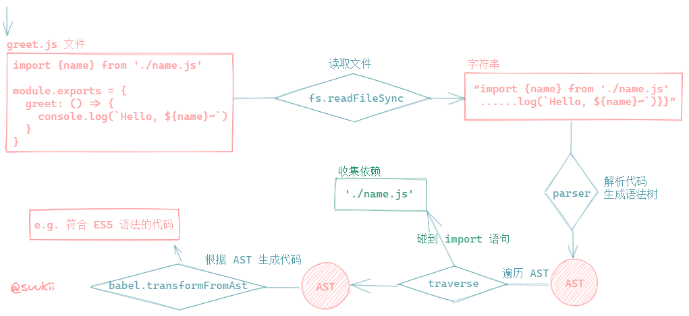
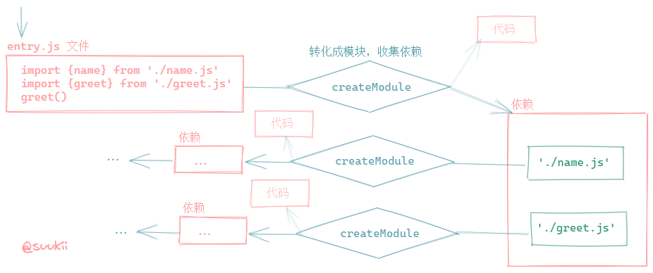
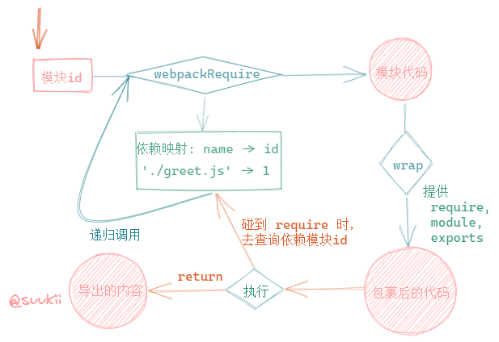

# 从零开始开发一个 webpack: Part 1

## 本节目标

实现一个打包工具最基本的功能，即根据入口文件扫描依赖，并进行模块化加载等。

## 准备工作

> 如果觉得先看这些概念比较枯燥，可以先看看打包过程的[图解](#生成模块)，在代码中碰到这些 API 时再回来看看概念。

### webpack

开始之前呢，需要先对 webpack 有一个大概的了解，如果完全不知道的话，建议先去看一下官网的[文档](https://webpack.js.org/concepts/)。

### Nodejs API

代码中用到了几个 Nodejs 内置的模块，所以先来简单介绍一下用到的 API，如果想要更详细地了解，可以去看[官方文档](https://nodejs.org/api/)。

#### fs.readFileSync(path[, options])

同步读取一个文件并返回文件的内容。

- `path` 是一个绝对路径；
- `options` 是可选参数，如果设置了 `encoding` 选项，这个方法会返回一个字符串，否则返回的会是 `buffer`。

> Nodejs 同步和异步 API 的命名套路是，同步 API 一般都有 Sync 字样，而异步 API 就没有。

#### fs.writeFile(file, data[, options], callback)

异步往一个文件中写入数据，而且会覆盖原本的内容。

- `file` 是文件名；
- `data` 是要写入的数据；
- `options` 中可以指定写入数据的格式，因为我们要写入的是字符串，所以可以在此指定 `{ encoding: 'utf-8' }`；
- `callback` 写入操作完成后的回调函数，在这里也可以拿到报错信息。

> 如果要写入的文件不存在的话，这个方法会报错。为了简化操作，在这个例子里我们就先自己新建一个 `dist/bundle.js` 文件，用来存放打包后的代码。

#### path.resolve([...path])

将多个路径拼起来，返回一个绝对路径。

```js
path.resolve('/foo/bar', './baz');
// return '/foo/bar/baz'
```

#### __dirname

返回当前目录。

### Babel

我们还用到了几个 babel 模块，先来粗略了解一下它们的功能吧。

#### @babel/parser

[`@babel/parser`](https://babeljs.io/docs/en/babel-parser) 是一个 babel 工具库，我们用它来将代码转化成 AST，也就是抽象语法树。

[AST Explorer](https://astexplorer.net/) 可以让我们实时看到代码是如何转化成 AST 的，如果不了解 AST 的概念，可以去看看。

#### @babel/traverse

[`@babel/traverse`](https://babeljs.io/docs/en/babel-traverse) 也是 babel 家族的一个库，我们用它来遍历 AST，找到 `import` 语句，从而实现依赖收集的功能。

#### @babel/core

`@babel/core` 是 babel 的一个核心模块，我们用到了它提供的一个内置 preset，[`@babel/preset-env`](https://babeljs.io/docs/en/babel-preset-env)，来将我们的代码转化成兼容性更强的代码。

## 生成模块

有了上面的知识，我们就可以开始着手实现了，首先我们要完成功能是，将 js 文件转化成模块并收集其所有依赖。

> 在这里我们只考虑静态引入，也就是只有使用 `import xxx from 'xxx'` 语法才会被收集为依赖。（暂不考虑动态引入的情况）

目标：

- 输入：js 文件
- 输出：1. 转化后的代码字符串(e.g. 将 ES6 转化成 ES5)，2. 该文件的所有依赖(依赖文件的路径字符串数组)

#### 图解



#### 文字

1. 读取 `greet.js` 文件，获得代码字符串；
2. 解析代码字符串，生成 AST；
3. 遍历 AST，找到所有 `import` 语句，收集依赖；
4. 将 AST 转化成 ES5 代码。

#### 代码

```js
const createModule = (id, path) => {
  // 读取代码文件
  const sourceCode = fs.readFileSync(path, {
    encoding: 'utf-8'
  })

  // 将代码转换成 AST
  const ast = parser.parse(sourceCode, {
    sourceType: 'module'
  })

  // 遍历 AST，找到 import 语句
  // 把依赖收集到 dependencies 中
  const dependencies = []
  traverse(ast, {
    ImportDeclaration({
      node
    }) {
      dependencies.push(node.source.value)
    }
  })

  // 生成兼容性更强的代码
  const code = babel.transformFromAst(ast, null, {
    presets: ['@babel/preset-env']
  }).code

  /**
   * 模块包含了：
   * 1. 唯一的 id
   * 2. 代码字符串
   * 3. 所有依赖的文件路径
   * 4. 原 js 文件的路径
   * 5. mapping 是依赖的文件名和对应的模块 id 的映射
   */
  return {
    id,
    code,
    dependencies,
    filename: path,
    mapping: {}
  }
}
```

## 构建依赖树

我们已经知道了如何生成一个模块，那怎么构建一个项目的依赖树就变得很简单了。

#### 图解



#### 文字

1. 读取入口文件，使用 `createModule` 函数将它转化成模块；
2. 找到入口文件的所有依赖，递归地调用 `createModule` 函数；
3. 直到所有代码都被找到了。

#### 代码

```js
const createModules = (id, module) => {
  // modules 数组中存放着项目的所有模块
  let modules = []
  const {
    dependencies,
    filename
  } = module

  // 以 module 为起点，递归地去找出所有依赖
  dependencies.forEach(depPath => {
    const absolutePath = path.resolve(path.dirname(filename), depPath)
    const depModule = createModule(id, absolutePath)
    // 将依赖模块加入到 module 的 mapping 中去
    module.mapping[depPath] = id
    id++
    modules = modules.concat(depModule)
    // 如果 module 的依赖模块也有自己的依赖，递归地找出它们的依赖
    if (depModule.dependencies.length > 0) {
      modules = modules.concat(createModules(id, depModule))
    }
  })
  return modules
}
```

有了 `createModule` 和 `createModules` 这两个方法，我们已经可以构建一个项目的依赖树了。如果我们将仓库中的 `/example/entry.js` 文件作为入口文件进行依赖构建，那么我们现在能得到的 `modules` 数组大概长这样：

```js
[
  {
    id: 0,
    code: 'some code',
    dependencies: [ './greet.js' ],
    filename: '/mini-webpack/example/entry.js',
    mapping: { './greet.js': 1 }
  },
  {
    id: 1,
    code: 'some code',
    dependencies: [ './name.js' ],
    filename: '/mini-webpack/example/greet.js',
    mapping: { './name.js': 2 }
  },
  {
    id: 2,
    code: 'some code',
    dependencies: [],
    filename: '/mini-webpack/example/name.js',
    mapping: {}
  }
]
```

## 输出代码

如果你有在控制台打印转化后的代码，你会发现其中的 `import` 语句被转化成了 `require`，而 `export` 语句被转化成了 `module.exports` 和 `exports`。

> 浏览器不一定支持 ES6 module 

但是 `require`, `module.exports` 和 `exports` 这些并不是 JS 的 API，在浏览器中不能正常执行，所以我们得想办法提供这些 API。

具体的做法就是把用一个函数把转化后的模块代码包裹起来，把这些 API 作为参数传入函数中，然后在函数体中执行模块代码。

#### 图解



#### 文字

1. 根据 id 获取模块代码及其依赖映射 mapping；
2. 定义一个根据文件名找到模块的 require 函数；
3. 定义 module 和 module.exports 来存放模块的导出内容；
4. 创建包裹函数 wrap 来执行模块代码并返回模块的导出内容。

#### 代码

```js
const webpackRequire = id => {
  const {
    code,
    mapping
  } = modules[id]

  // fake require 方法
  const require = name => {
    return webpackRequire(mapping[name])
  }

  // fake module 和 module.exports
  const module = {
    exports: {}
  }

  // 执行模块代码
  // PS. 如下可以看到，在模块中 module.exports 和 exports 指向同一个对象
  const wrap = new Function('require', 'module', 'exports', code)
  wrap(require, module, module.exports)

  // 返回导出内容
  return module.exports
}
```

生成项目的所有模块这一步是在打包阶段完成的，而找到并执行模块代码这一步是在浏览器中进行的，所以我们还需要一个函数来生成 `webpackRequire` 函数并将所有模块 `modules` 作为参数传入，然后通过 `fs.writeFile` 将它们写入文件系统。

```js
const createAssets = modules => {
  return `
    (function (modules) {
      const webpackRequire = id => {
        const {
          code,
          mapping
        } = modules[id]

        // fake require 方法
        const require = name => {
          return webpackRequire(mapping[name])
        }

        // fake module 和 module.exports
        const module = {
          exports: {}
        }

        // 执行模块代码
        // PS 如下可以看到，在模块中 module.exports 和 exports 是同一个东西
        // 前提是不修改它们的指向
        const wrap = new Function('require', 'module', 'exports', code)
        wrap(require, module, module.exports)

        // 返回导出内容
        return module.exports
      }
      webpackRequire(0)
    })(${JSON.stringify(modules)})
  `
}
```

## Wrapping up

目前为止我们已经实现了本节目标所提的所有功能，但这些功能都是分散的，我们需要提供一个 API。我们来实现一个 `bundle` 方法，它需要做两件事情：

1. 根据入口文件构建项目的依赖树，也就是生成 modules；
2. 将生成的代码字符串输出到指定的出口文件中。

```js
const bundle = options => {
  const {
    entry,
    output
  } = options

  // 获取入口文件
  let id = 0
  const entryModule = createModule(id++, path.resolve(__dirname, entry))
  // 根据入口文件递归找出所有依赖模块
  const modules = [entryModule].concat(createModules(id, entryModule))

  // 生成代码并输出到文件系统
  const code = createAssets(modules)
  fs.writeFile(path.resolve(output.path, output.filename), code, {
    encoding: 'utf-8'
  }, function (err, data) {
    if (err) throw err
  })
}
```

至此我们就完成了一个打包工具最简单的功能，根据入口文件扫描依赖，并进行模块化加载。

## Reference

[https://github.com/azl397985856/mono-webpack/tree/lecture/part-1](https://github.com/azl397985856/mono-webpack/tree/lecture/part-1)